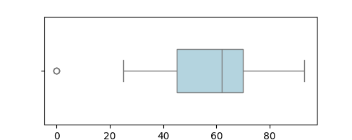
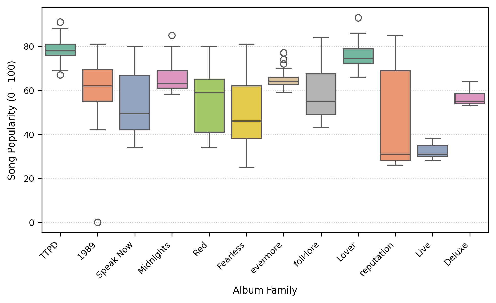
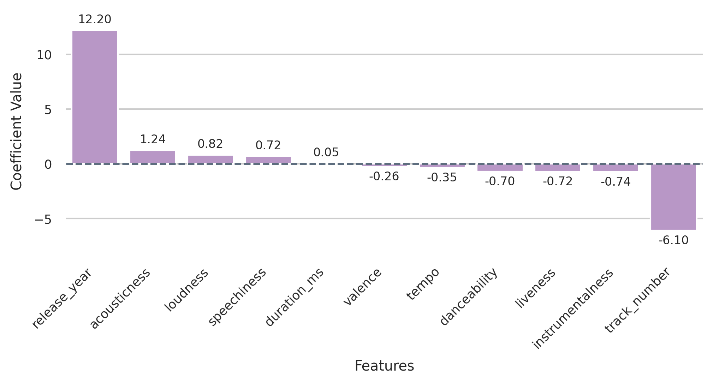
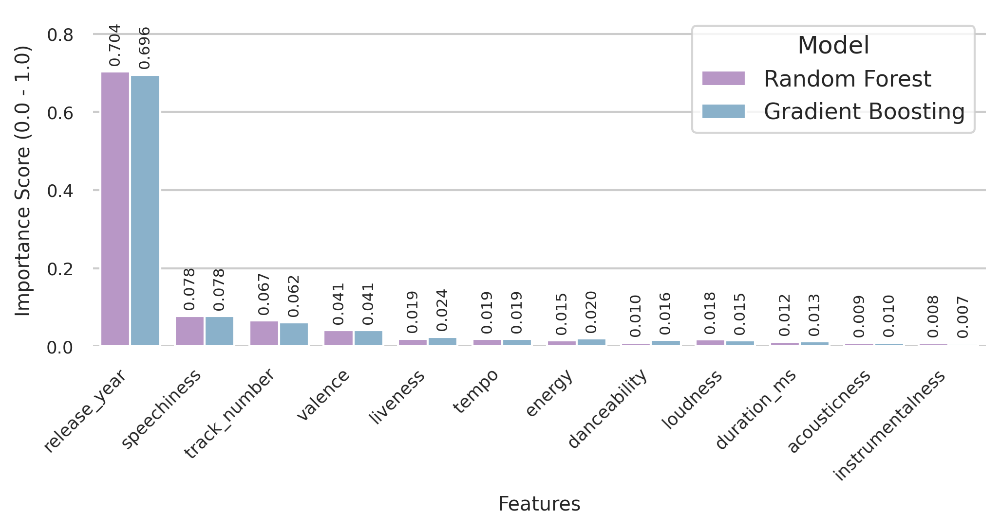
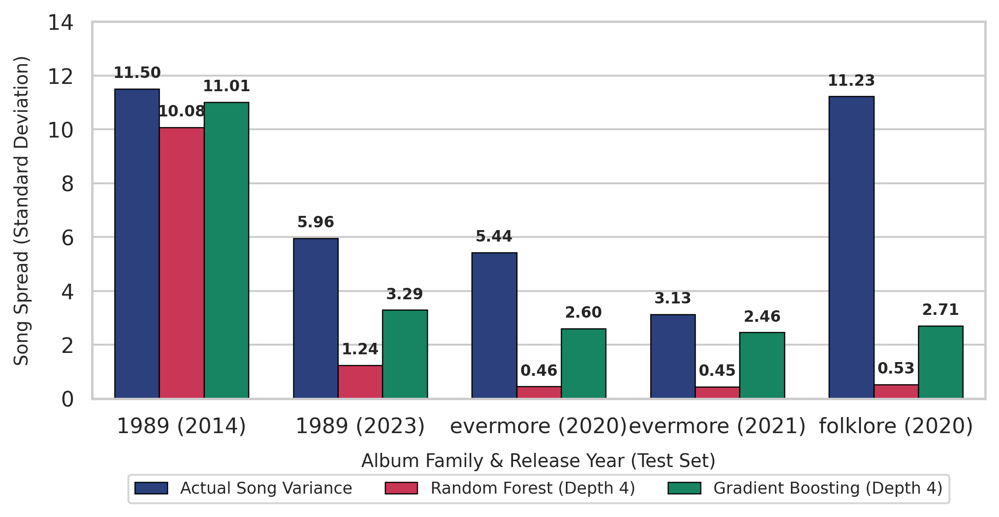

#  Predicting Spotify Track Popularity: Supervised Regression Modeling of Audio and Structural Features

An empirical Supervised Machine Learning (SML) research pipeline developing predictive regression architectures to forecast track popularity from combined acoustic-structural features and assessing their broader industry generalizability. This repository benchmarks parametric Ordinary Least Squares (OLS) Linear Regression against non-parametric tree ensembles (Random Forest and Gradient Boosting Regressors).
## 📌 Project Overview & Feature Architecture

Traditional music popularity forecasting frequently falls into an "Acoustic Isolation Trap", predicting commercial success strictly from raw audio signals while ignoring chronological and structural album context. To bridge this empirical gap, this study formulates track popularity forecasting (*Y* ∈ [0, 100]) as a supervised machine learning regression task over Taylor Swift's extensive discography (*N* = 579), utilizing her diverse two-decade career and stylistic shifts as an optimal case study.

The predictive framework models track popularity against an independent feature matrix (*X*) of 12 numeric predictors partitioned into two functional categories:

* **Nine Intrinsic Acoustic Features:** `acousticness`, `danceability`, `energy`, `instrumentalness`, `liveness`, `loudness`, `speechiness`, `tempo`, and `valence`.
* **Three Structural-Conceptual Features:**
  * `track_number`: Album sequential position.
  * `duration_ms`: Track length in milliseconds.
  * `release_year`: Calendar year of release.
## 🔬 Core Research Questions

* **RQ1 (Predictive Capacity):** Can supervised machine learning architectures accurately predict individual song popularity based on a combined acoustic-conceptual feature matrix?
* **RQ2 (Generalizability):** To what extent can an artist-specific predictive framework successfully generalize across the broader music industry?


---

## 📁 Repository Structure

```text
taylor-swift-spotify-sml/
│
├── Code & Data Execution Guide.pdf # Step-by-step Execution & Reproduction Guide
├── Taylor_swift_smlproject.py       # Initial Data Science Lifecycle, Exploratory Baselines & CSV Export
├── winning_models_sml2.py           # Final Production Script (OLS, Random Forest & Gradient Boosting)
├── taylor_swift_spotify.csv         # Raw Spotify Dataset (582 records, 18 columns)
├── taylor_baseline.csv              # Preprocessed Dataset tailored for OLS (11 features, N = 579)
├── taylor_improved.csv              # Preprocessed Dataset tailored for Tree Ensembles (12 features, N = 579)
├── SML final project Kerem Bar.pdf  # Comprehensive SML Academic Research Report
├── Figure1.png                      # Boxplot Outlier Isolation for Target Variable Popularity
├── Figure2.png                      # Song Popularity Distribution by Album Families
├── Figure3.png                      # Standardized Linear Coefficient Weights
├── Figure4.png                      # Feature Importance of Both Tree Ensemble Models
├── Figure5.png                      # Empirical Evidence of Predictive Variance Collapse
└── README.md                        # Detailed Repository Architecture & Research Findings
```
---

## 📌 Data Preprocessing & Leak-Free Architecture

To establish a stable and mathematically robust predictive environment across a multi-era discography, the preprocessing pipeline executes five structural engineering steps:

### 1. Outlier Isolation & Dataset Finalization (Figure 1)

Exploratory IQR analysis on the raw dataset (*N* = 582) established a mathematical lower fence at 7.5 popularity points. Exactly 3 observations fell below this threshold with a continuous popularity score of 0. Targeted qualitative inspection confirmed these entries were non-musical voice memos from the *1989 (Deluxe Edition)*. To eliminate structural noise and stabilize modeling variance, a deterministic filter (`popularity > 0`) was applied, finalizing a clean modeling space of *N* = 579 musical tracks.

### 2. Catalog Structuring & Leak-Free Group Partitioning (Figure 2)

To resolve severe data leakage caused by sonically identical entries across catalog re-recordings and expanded editions, individual release titles were consolidated into unified `album_family` entities (for example, consolidating the original, deluxe, and re-recorded releases of *1989* under a single `1989` album family). 

The discography was partitioned using `scikit-learn`'s `GroupShuffleSplit` under an out-of-sample holdout strategy (80/20 train-test ratio). This guaranteed that entire unseen eras—comprising the `1989`, `folklore`, and `evermore` album families—were strictly isolated into `X_test`, ensuring the models were evaluated entirely on out-of-sample discographic contexts. This exact train-test partition (`X_train`, `X_test`, `y_train`, `y_test`) was held identical across all three benchmarked regression architectures to ensure strict comparative validity.

### 3. Chronological Feature Extraction & Categorical Dummy Substitution

* **Temporal Feature Extraction (`release_date` → `release_year`):**
  To represent chronological progression numerically, `release_year` was extracted from raw `release_date` strings as an integer feature.

* **Capturing Album-Family Context via Continuous Proxies:**
  Under strict group partitioning, holdout album families exist exclusively within `X_test`. Applying One-Hot Encoding directly on `album_family` generates dummy columns with zero variance (all zeros) across `X_train`. Under these conditions, parametric models (OLS) cannot estimate valid coefficients ($\beta$), and decision trees cannot establish meaningful split criteria on zero-variance training columns.

  To preserve the album family essence without categorical breakdown, continuous features were utilized as generalized numeric proxies:
  * `release_year`: Encodes the chronological era and historical production context of each album family.
  * `track_number`: Captures sequential curation, structural placement, and album pacing.
  * `duration_ms`: Represents compositional scale and track length.

### 4. Multicollinearity Diagnostic & Empirical Feature Pruning (Figure 3)

Correlation analysis revealed a strong linear dependency between `energy` and `loudness` (*r* = 0.80). To evaluate its practical impact on linear modeling, the OLS regression was empirically tested both with and without `energy`. Removing `energy` stabilized coefficient estimation and resulted in superior predictive performance. Consequently, `energy` was omitted from the baseline linear model, while retained for tree ensemble architectures which naturally handle collinear inputs and non-linear interactions.

This distinction established two dedicated modeling matrices:
* `taylor_baseline.csv`: Excludes `energy` for baseline linear regression benchmarking.
* `taylor_improved.csv`: Retains the complete feature space for tree ensemble modeling.

### 5. Leak-Free Feature Standardization

Raw features span vastly different numerical scales (e.g., `duration_ms` in hundreds of thousands versus audio features bounded between 0 and 1), thus standardizing features is essential to ensure stable OLS coefficient estimation and uniform feature weighting. To strictly prevent data leakage, $Z$-score standardization (`StandardScaler`) was fitted exclusively on `X_train`, and the resulting parameters (mean and standard deviation) were subsequently applied to transform `X_test`.

---

## 📊 Model Evaluation & Performance Benchmarking

### 🔍 Multicollinearity Diagnostics & Energy Sensitivity Analysis

To assess potential variance inflation and high correlation among acoustic predictors, specifically between `energy` and `loudness`, the parametric Ordinary Least Squares (OLS) baseline was estimated under two specifications:

1. **Linear Regression (Full):** Incorporating all 12 acoustic and structural predictors (Includes `energy`).
2. **Linear Regression (Stabilized):** Isolating the impact of collinearity by omitting the `energy` parameter (Excludes `energy`).

Consequently, the stabilized OLS specification demonstrated superior parameter stability and generalization, establishing it as the winning linear benchmark against the non-parametric tree ensembles (Random Forest and Gradient Boosting).

### 🏆 Empirical Benchmark Results & Specification Comparison

Across the three core regression architectures, four experimental specifications were evaluated across identical partition splits (`X_train` vs. `X_test`). Hyperparameter tuning via grid search enforced a maximum tree depth boundary of 4 across tree ensembles to prevent severe training data over-memorization.
| Model Architecture | Feature Configuration | Train RMSE | Test RMSE | Train R² | Test R² |
| :--- | :--- | :--- | :--- | :--- | :--- |
| **Linear Regression (Full)** | Full 12 Features | 11.4240 | 10.8603 | 0.5595 | -0.1536 |
| **Linear Regression (Stabilized)** | 11 Features (Excludes `energy`) | 11.4302 | 10.7815 | 0.5590 | -0.1369 |
| **Random Forest Regressor** | Full 12 Features | 7.6028 | 10.7317 | 0.8049 | -0.1264 |
| **Gradient Boosting Regressor** | Full 12 Features | 3.2835 | 10.7190 | 0.9636 | -0.1238 |
---

## 🔍 Diagnostic Analysis: The Predictive R² Collapse

Regardless of algorithmic complexity, all modeled architectures hit a rigid predictive ceiling on unseen eras, converging to a Test RMSE around 10.7 and negative R² values (R² < 0). A negative R² mathematically indicates that the model's residual sum of squares exceeds the total sum of squares around the sample mean, performing worse than a naive benchmark tracking the mean of X_test.

### 1. Linear Coefficient Breakdown & Rigid Acoustic Rules (Figure 3)
Evaluating the learned weights of the stabilized OLS model revealed that sparse right-hand tails in asymmetric training predictors exerted extreme statistical leverage:
* **The Positive Acousticness Rule (+1.24 coefficient):** The model falsely equated high acoustic density with guaranteed commercial success. In X_test, this rule collapsed due to internal polarization: frontline acoustic hits achieved peak popularity (77–78 at acousticness 0.77–0.92), whereas deep acoustic cuts with near-absolute acousticness (0.964) collapsed to low streaming traction (popularity: 43).
* **The Negative Liveness Rule (-0.72 coefficient):** The model penalized elevated liveness scores. However, studio pop productions with arena-style reverb registered high liveness (0.32–0.38) while maintaining peak popularity (71–80), whereas actual live sessions (liveness: 0.791) yielded low platform traction (popularity: 54).

### 2. The Chronological Trap & Predictive Variance Collapse (Figure 4 & Figure 5)
Both tree ensemble models fell into an extreme chronological trap. Rather than mapping localized acoustic structures, top-level branch splits allowed `release_year` to dominate architectural utility, capturing **70.4% importance weight in Random Forest** and **69.6% in Gradient Boosting** (Figure 4).

This reliance triggered a total **Predictive Variance Collapse** (Figure 5), flattening genuine empirical standard deviations into static, era-specific predictions:
* **folklore (2020):** Actual popularity standard deviation = 11.23 -> Predicted standard deviation = 0.53 (RF) and 2.71 (GB).
* **evermore (2020):** Actual popularity standard deviation = 5.44 -> Predicted standard deviation = 0.46 (RF) and 2.60 (GB).
* **1989 (2023 Re-recording):** Actual popularity standard deviation = 5.96 -> Predicted standard deviation = 1.24 (RF) and 3.29 (GB).

---

## 💡 Key Conclusions & Future Work

Based on empirical evaluations, both research questions yielded a definitive **negative conclusion**:

* **RQ1 Conclusion (Negative):** Individual song popularity cannot be predicted using acoustic-conceptual feature matrices alone. Non-parametric complexity cannot rescue a framework when engineered features evaluate complex artistic progression through a rigid chronological lens.
* **RQ2 Conclusion (Negative):** The predictive framework cannot generalize across the broader music industry. The learned logic functions as a specialized career tracker tied strictly to Taylor Swift's unique streaming timeline and catalog replication milestones.

### 🚀 Proposed Future Directions
To overcome these structural boundaries while preserving catalog integrity, future iterations should implement two practical methodological adjustments:
1. **Distribution-Based Preprocessing:** Apply a standard log(x+1) transformation exclusively to highly skewed, non-normal acoustic parameters (e.g., speechiness, instrumentalness) to stabilize training leverage and accommodate zero-value bounds.
2. **Chronological Abstraction via External Exposure Proxies:** Replace the static, artist-specific `release_year` feature with dynamic, time-varying external metrics (e.g., media appearance frequencies, social media engagement volume, and tour scheduling intensity).

---

## 📊 Visualizations Highlights

| <div style="width: 280px">Figure 1: Boxplot Outlier Isolation</div> | Figure 2: Popularity by Album Family |
| :---: | :---: |
|  |  |
| *Box plot isolating 3 voice memo outliers with 0 popularity.* | *Box plot illustrating popularity dispersion across album families.* |

| Figure 3: Standardized OLS Coefficients | Figure 4: Feature Importance Comparison |
| :---: | :---: |
|  |  |
| *Feature weights in stabilized OLS (+12.20 release_year).* | *Feature importance across RF and GB (~70% release_year).* |

| Figure 5: Predictive Variance Collapse |
| :---: |
|  |
| *Empirical proof comparing actual song variance against flattened predictions in X_test.* |
---

## 🛠️ Tech Stack & Dependencies

* **Language:** Python 3.10+
* **Data Science Libraries:** Pandas, NumPy, Scikit-learn
* **Visualization Tools:** Matplotlib, Seaborn
* **Primary Models:** `LinearRegression`, `RandomForestRegressor`, `GradientBoostingRegressor`
* **Validation Modules:** `GroupShuffleSplit`, `StandardScaler`

---

## 🚀 How to Execute the Pipeline

For detailed execution paths, dependencies, and environment configuration, refer to the included `Code & Data Execution Guide.pdf`.

```bash
# 1. Clone the repository
git clone [https://github.com/Kerem-Bar/taylor-swift-spotify-sml.git](https://github.com/Kerem-Bar/taylor-swift-spotify-sml.git)

# 2. Execute Full Lifecycle & Generate Preprocessed Datasets
# (Executes cleaning, feature extraction, and saves taylor_swift_spotify.csv, taylor_baseline.csv, and taylor_improved.csv)
python Taylor_swift_smlproject.py

# 3. Run Winning Models & Reproduce Benchmark Figures
# (Trains OLS, Random Forest, Gradient Boosting and generates Figures 1-5)
python winning_models_sml2.py
```

---

## 👤 Author

**Kerem Bar**  
Master's Student in Information Sciences (Information Technology Specialization)
